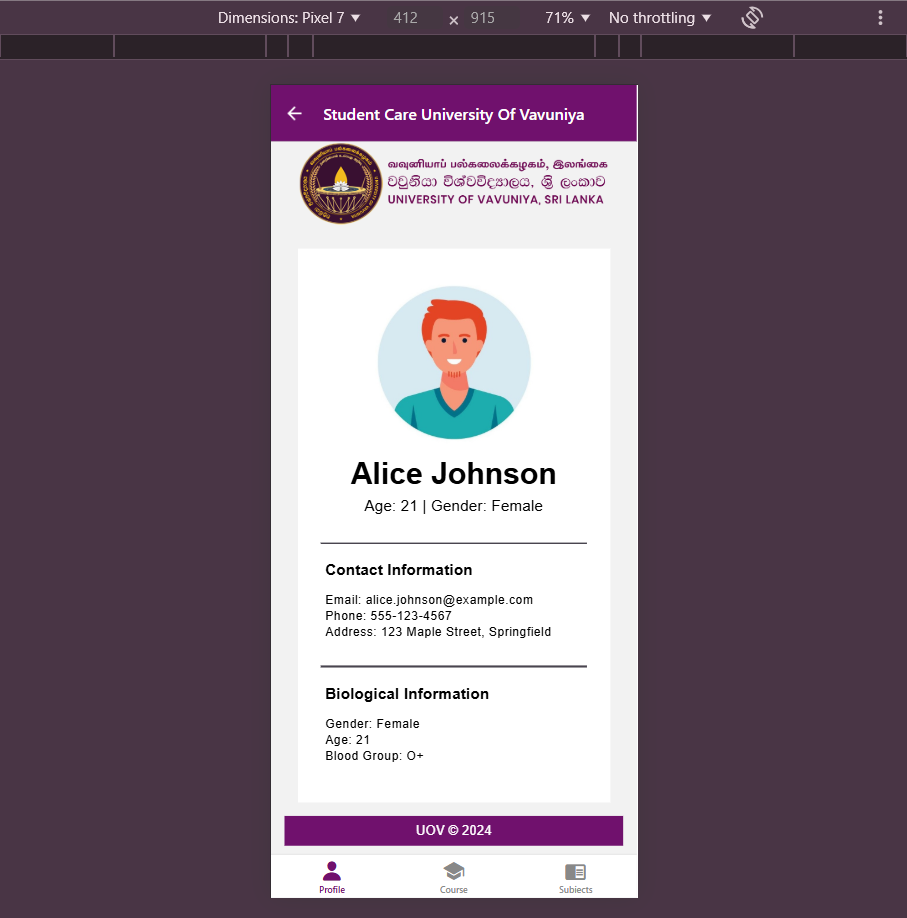
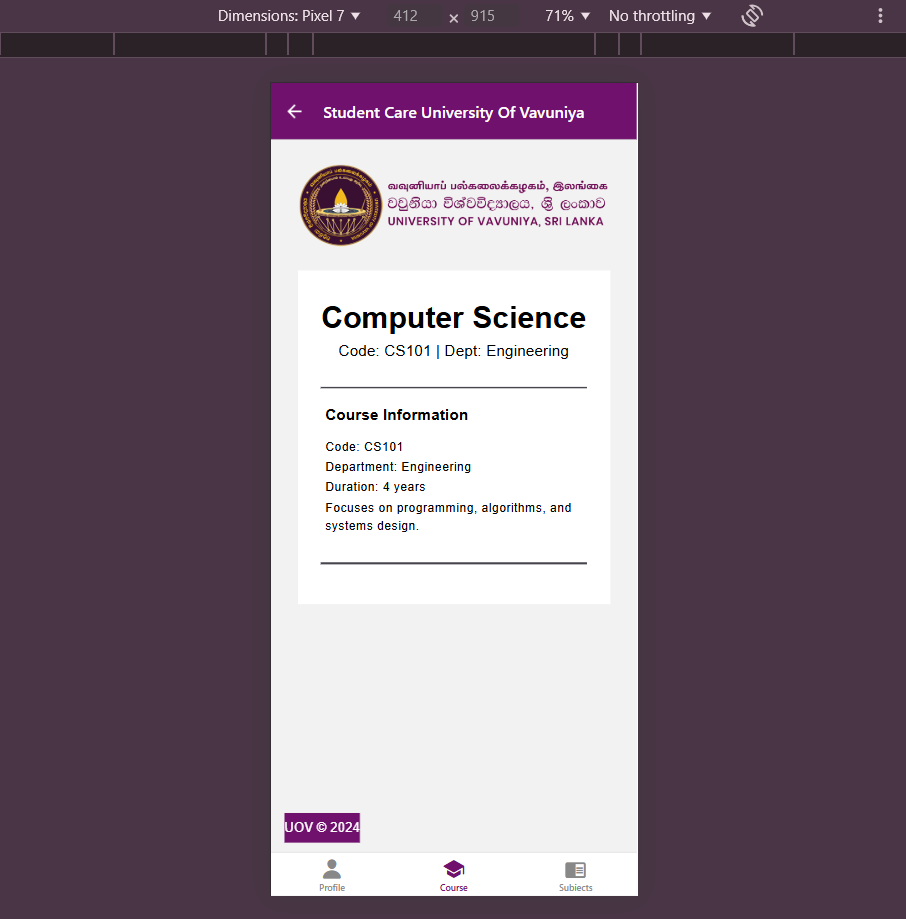
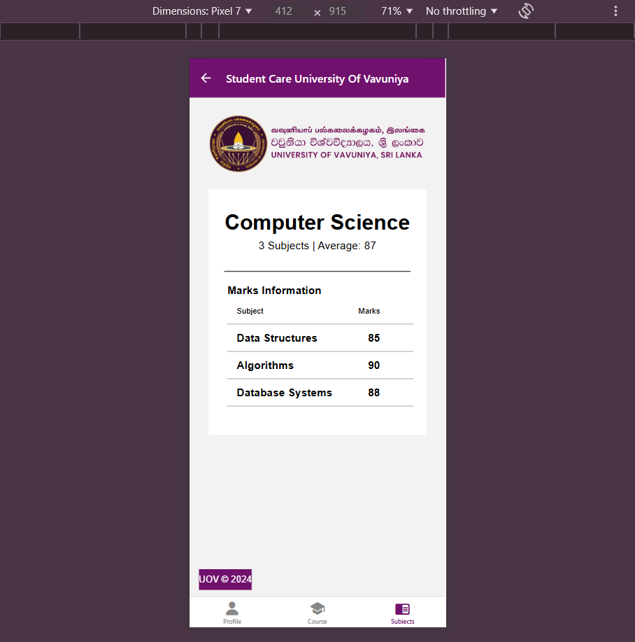

# Student Care App - University of Vavuniya

The Student Care App is a comprehensive mobile application designed to support students at the University of Vavuniya. It offers a centralized platform for accessing academic resources, managing schedules, and connecting with university services.

## Features

- **Academic Resources**: Access course materials, lecture notes, and assignments.
- **Schedule Management**: View class timetables and set reminders for important deadlines.
- **University Services**: Connect with counseling, health services, and academic advisors.
- **Notifications**: Receive real-time updates on university announcements and events.
- **Profile Management**: Update personal information and track academic progress.

## Technologies Used

- **Frontend**: React Native
- **Backend**: Node.js with Express
- **Database**: MongoDB
- **Authentication**: JWT (JSON Web Tokens)
- **Hosting**: Deployed on [Hosting Platform] (e.g., Heroku, AWS)

## Getting Started

### Prerequisites

- Node.js installed on your machine
- MongoDB instance running locally or on the cloud
- Android Studio or Xcode for mobile development
- A modern web browser

### Installation

1. **Clone the repository**:
   ```bash
   git clone https://github.com/IT3133-Practical-Sessions-Assignments/Assignment3-Student-CareApp.git
   ```
2. **Navigate to the project directory**:
   ```bash
   cd student-care-app
   ```
3. **Install the dependencies**:
   ```bash
   npm install
   ```
4. **Start the Metro bundler**:
   ```bash
   npm start
   ```
5. **Run the app on an emulator or physical device**:
   - For Android:
     ```bash
     npm run android
     ```
   - For iOS:
     ```bash
     npm run ios
     ```

## Usage

- **Sign Up**: New users can sign up using their university credentials.
- **Login**: Existing users can log in with their email and password.
- **Access Services**: Navigate through the app to utilize various support services.
- **Manage Profile**: Update personal information and monitor academic progress.

## Contributing

We welcome contributions to the Student Care App. Please follow these steps:

1. **Fork the repository**.
2. **Create a new branch** for your feature or bug fix:
   ```bash
   git checkout -b feature-name
   ```
3. **Commit your changes**:
   ```bash
   git commit -m "Description of changes"
   ```
4. **Push to your forked repository**:
   ```bash
   git push origin feature-name
   ```
5. **Open a pull request** in the main repository.

## License

This project is licensed under the MIT License - see the [LICENSE](LICENSE) file for details.

## Acknowledgments

- University of Vavuniya for supporting this project.
- The development team for their dedication and hard work.

---

## Outputs Images

**Login Page**


**Profile Page**



**Course Page**



**Subject Page**


